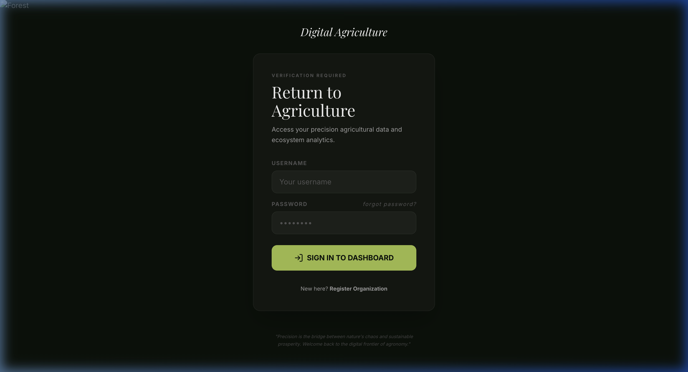
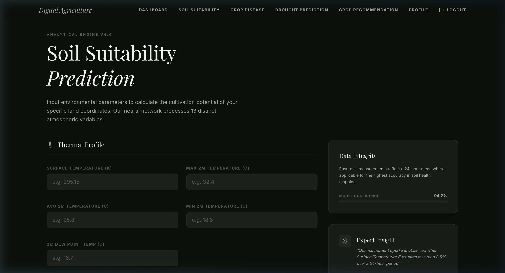
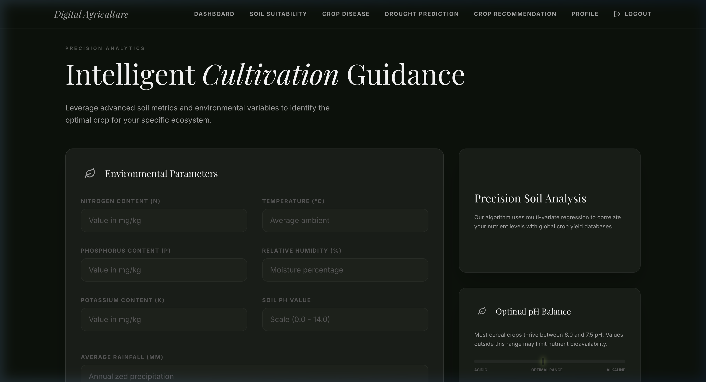

<div align="center">

# 🌾 Digital Agriculture

**Precision Agricultural Intelligence Platform**

A full-stack machine learning platform that empowers farmers and agronomists with AI-driven insights — from crop recommendations to disease detection.

[](https://python.org)
[](https://flask.palletsprojects.com)
[](https://react.dev)
[](https://tensorflow.org)
[](https://docker.com)

</div>

---

## ✨ Features

| Module | Description |
|---|---|
| 🌱 **Crop Recommendation** | Recommends the top 3 best-fit crops based on soil nutrients, pH, temperature, humidity, and rainfall |
| 🔬 **Crop Disease Detection** | Upload a photo of a leaf — a dual neural network (CNN + ViT) identifies the pathogen with confidence score |
| 💧 **Drought Resistance Prediction** | Predicts crop survival rate under arid stress using 19 physiological and genomic markers |
| 🗺️ **Soil Suitability Analysis** | Scores land suitability (0–100%) by analyzing 13 atmospheric and environmental variables |
| 📊 **Prediction Dashboard** | Centralised view of all past predictions with charts, history timeline, and export to PDF |
| 📧 **Report Export** | Send a full PDF prediction report directly to any email address |

---

## 📸 Screenshots

<table>
  <tr>
    <td><br/><sub><b>Sign In</b></sub></td>
    <td><br/><sub><b>Dashboard</b></sub></td>
  </tr>
  <tr>
    <td><br/><sub><b>Crop Disease Detection</b></sub></td>
    <td><br/><sub><b>Soil Suitability</b></sub></td>
  </tr>
  <tr>
    <td><br/><sub><b>Drought Resistance Engine</b></sub></td>
    <td><br/><sub><b>Crop Recommendation</b></sub></td>
  </tr>
</table>

---

## 🏗️ Tech Stack

**Backend**
- [Flask](https://flask.palletsprojects.com) — REST API & server
- [TensorFlow 2.16](https://tensorflow.org) — CNN crop disease model
- [Hugging Face Transformers](https://huggingface.co) — Vision Transformer (ViT) pathogen classifier
- [scikit-learn](https://scikit-learn.org) — Crop recommendation & soil suitability models
- [SQLite](https://sqlite.org) — User database & prediction logs
- [fpdf2](https://py-pdf.github.io/fpdf2/) — PDF report generation
- [Flask-Mail](https://pythonhosted.org/Flask-Mail/) — Email delivery

**Frontend**
- [React 19](https://react.dev) + [Vite](https://vitejs.dev)
- [Tailwind CSS](https://tailwindcss.com)
- [Framer Motion](https://www.framer.com/motion/) — Animations
- [Recharts](https://recharts.org) — Data visualisation
- [Zustand](https://zustand-demo.pmnd.rs) — State management

---

## 🚀 Getting Started

### Prerequisites

- Python 3.10+
- Node.js 18+
- Git

### 1. Clone the repository

```bash
git clone https://github.com/japhii/Digital-Agriculture.git
cd Digital-Agriculture
```

### 2. Set up the backend

```bash
# Create and activate a virtual environment
python -m venv .venv
source .venv/bin/activate  # Windows: .venv\Scripts\activate

# Install dependencies
pip install -r requirements.txt
```

### 3. Configure environment variables

Create a `.env` file in the root directory:

```env
MAIL_USERNAME=your_email@gmail.com
MAIL_PASSWORD=your_app_password
MAIL_DEFAULT_SENDER=your_email@gmail.com
```

> **Note:** For Gmail, generate an [App Password](https://myaccount.google.com/apppasswords) — do not use your regular Gmail password.

### 4. Add the ML models

Place the trained model files inside the `Models/` directory:

```
Models/
├── Crop Recommendation/
│   └── model_v2.pkl
├── Disease_prediction/
│   └── best_plant_disease_model.h5
├── Drought Prediction/
│   ├── model.pkl
│   └── encoders.pkl
└── Soil Suitability/
    ├── prediction_model_v2.pkl
    └── scaler_v2.pkl
```

### 5. Build the frontend

```bash
cd frontend
npm install
npm run build
cd ..
```

### 6. Run the app

```bash
python app.py
```

Open [http://localhost:1234](http://localhost:1234) in your browser.

---

## 🐳 Docker

```bash
docker build -t myagrii .
docker run -p 1234:1234 --env-file .env myagrii
```

---

## 🧠 How to Use

### Crop Recommendation
1. Navigate to **Crop Recommendation**
2. Enter soil nutrient values (N, P, K), pH, temperature, humidity, and rainfall
3. Click **Analyse** — get the top 3 recommended crops with confidence scores

### Crop Disease Detection
1. Navigate to **Crop Disease**
2. Upload or drag-and-drop a clear photo of the affected leaf (JPG/PNG)
3. The system uses a CNN + ViT pipeline to identify the disease and return confidence

### Drought Resistance Prediction
1. Navigate to **Drought Prediction**
2. Fill in climate variables (temperature, humidity, solar radiation, etc.) and toggle genomic markers (ZmDREB2A, ZmNAC, Root QTL)
3. Submit to get a drought resistance score (0–100%)

### Soil Suitability Analysis
1. Navigate to **Soil Suitability**
2. Input 13 atmospheric measurements (temperatures, pressure, wind speed, precipitation, etc.)
3. Receive a suitability score and a scientific analysis summary

### Exporting Reports
From the **Dashboard**, click **Export Report** and enter an email address. A PDF summary of all your predictions will be sent instantly.

---

## 📁 Project Structure

```
MyAgrii/
├── app.py                    # Flask application & API routes
├── requirements.txt          # Python dependencies
├── Dockerfile                # Docker configuration
├── frontend/                 # React + Vite frontend
│   └── src/
│       ├── pages/            # Login, Dashboard, Disease, Drought, Crop, Soil
│       ├── components/       # Shared UI components
│       └── store/            # Zustand state management
├── Crop_Recommendation/      # Crop recommendation model module
├── Disease_Prediction/       # Disease classification module
├── Drought_Prediction/       # Drought resistance module
├── Soil_Suitability_Prediction/ # Soil suitability module
└── Models/                   # Trained ML model files
```

---

## 📄 License

This project is open source. Feel free to fork, use, and build on it.

---

<div align="center">
Built Yaphet, for sustainable agriculture
</div>
